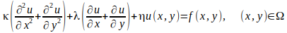
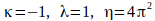
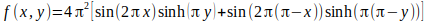
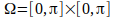
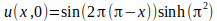
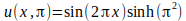
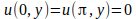
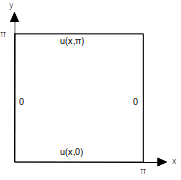

# PDE Solver
## Objetivo
O objetivo deste trabalho é implementar um programa para calcular a solução discreta para uma Equação Diferencial Parcial com duas variáveis indepententes utilizando Diferenças Finitas centrais de primeira ordem e o método de Gauss-Seidel.
## Especificação
O trabalho consiste em calcular a solução discreta, utilizando Diferenças Finitas Centrais e o Método de Gauss-Seidel, para a seguinte Equação Diferencial Parcial: 

onde:

O domínio é definido por: 
Nas fronteiras:

A discretização do domínio deve ser feita em uma malha com espaçamento entre os pontos (0<hx,hy<pi) calculados a partir do número de pontos em cada dimensão () dados como parâmetro do programa.

    Escolha uma estrutura de dados eficiente para representar o Sistema Linear resultante;
    Escolha um layout eficiente para as variáveis e termos independentes do seu sistema;
    Use um vetor nulo como estimativa inicial para a solução;

## Execução
O pacote de software a ser construído deve gerar um executável chamado pdeSolver, que deve ser invocado da seguinte forma:
      ./pdeSolver -nx <nx> -ny <ny> -i <maxIter> -o arquivo_saida
 Onde:
  
    -nx: parâmetro obrigatório definindo o número de pontos a serem calculados na dimensão X.
    -ny: parâmetro obrigatório definindo o número de pontos a serem calculados na dimensão Y.
    -i maxIter: parâmetro obrigatório definindo o número de iterações a serem executadas.
    -o arquivo_saida: parâmetro no qual arquivo_saida é o caminho completo para o arquivo que vai conter a solução (valores da função em cada ponto da grade). Caso este parâmetro não esteja especificado, a saída deve ser stdout
        Esta solução deve estar formatada para servir de entrada ao comando gnuplot, de forma que ele possa automaticamente gerar o gráfico da função.
        Além disso, no início do arquivo, deve constar sob a forma de comentários do gnuplot:
            O tempo médio de execução de cada iteração do Método de Gauss-Seidel
            O valor do resíduo para cada iteração.

    ###########
    # Tempo Método GS: <média de tempo para o cálculo de uma iteração do método, em milisegundos>
    #
    # Norma L2 do Residuo
    # i=1: <valor>
    # i=2: <valor>
    # i=3: <valor>
    # ...
    ###########

        Tempo Método GS: deve ser calculado em milisegundos, utilizando-se a função timestamp() especificada aqui. O tempo é calculado a partir do início da iteração do método até a obtenção do vetor solução daquela iteração. O resultado deve ser a média aritmética do tempo de todas iterações.

## Makefile
O arquivo Makefile deve possuir as regras necessárias para compilar os módulos individualmente e gerar o programa executável. As seguintes regras devem existir OBRIGATORIAMENTE:

    all: compila e produz um executável chamado pdeSolver no diretório login1-login2/;
    clean: remove todos os arquivos temporários e os arquivos gerados pelo Makefile (*.o, executável, etc.).
    doc: gera a documentação Doxygen em formato html
